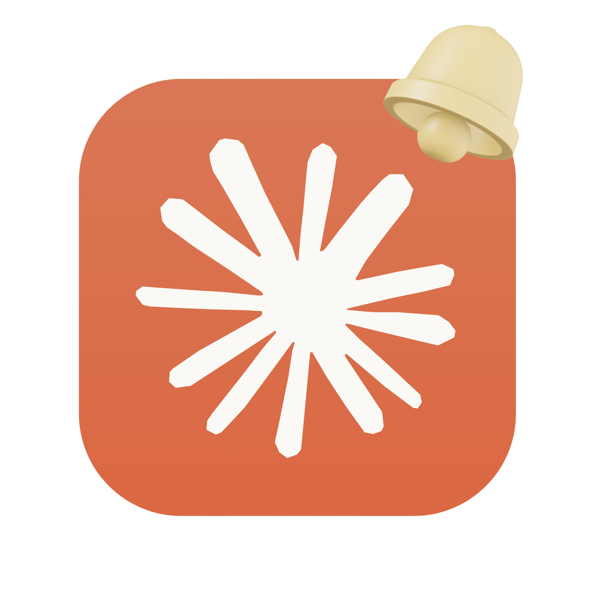

# claude-bell

<table><tr>
<td></td>
<td>

Tired of waiting Claude?  
Sound notifications for [Claude Code](https://claude.ai/code) via hooks.  
Plays a sound when Claude finishes a response, requests a permission, or asks a question so you can look away while it works.

</td>
</tr></table>

## Hooks installed

| Event | Sound (Linux) | Sound (macOS) |
|---|---|---|
| Claude stops (response complete) | `complete.oga` | `Glass.aiff` |
| Claude asks a question (`PostToolUse`) | `power-unplug.oga` | `Tink.aiff` |
| Permission request | `power-plug.oga` | `Blow.aiff` |

## Requirements

- **jq** — to merge hooks into `settings.json` without overwriting existing content
- **paplay** (Linux) or **afplay** (macOS) — to play sounds

```bash
# Debian / Ubuntu / Kali
sudo apt install jq

# macOS
brew install jq
```

`paplay` is included with PulseAudio (standard on most Linux desktops). `afplay` is built into macOS.

## Install

```bash
bash install.sh
```

The script:
1. Backs up `~/.claude/settings.json` to `~/.claude/settings.json.bak`
2. Merges the three hooks into your existing configuration
3. Does not overwrite any hooks you already have

Restart Claude Code after installation.

## Test

```bash
claude @TEST.md
```

## Uninstall

```bash
bash uninstall.sh
```
